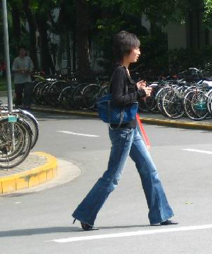
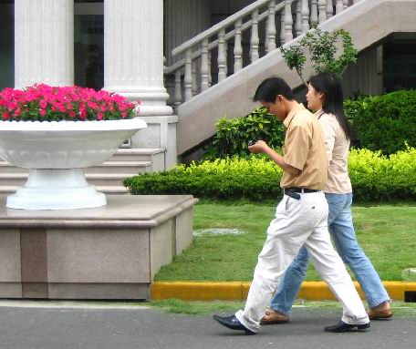

<h1 align="center"><b><i>People recognizer</i></b></h1>

    
    
      
    
    

    
    
     
    <i>Image on the left side was an input to recognizer.  
    On the right side is result with boxes indicating detected people.</i>

<h2> ⚙️ Model</h2>

For detection I used pretrained **YOLOv3 model**. It has been trained on COCO dataset with 80 possible classes. In my case, after detecting an object I check if label matches person class as I need only this one.   
More information about YOLOv3 can be found [here](https://pjreddie.com/darknet/yolo/).

<h2> :hammer: Input preprocessing</h2>

Image width and height are scaled to fit dimensions of model input.
Then image is transformed to BLOB1.

<h2> :page_facing_up: Dataset</h2>

As a dataset I chose [Penn-Fudan Database for Pedestrian Detection and Segmentation](https://www.cis.upenn.edu/~jshi/ped_html/). \
<cite>"This is an image database containing images that are used for pedestrian detection [...]. The images are taken from scenes around campus and urban street. [...] Each image will have at least one pedestrian in it. [...] All labeled pedestrians are straight up."</cite>

<h2> :interrobang: How does it work?</h2>

You can recognize people on some choosen images or all in selected directory.

1. Prepare data directory with images (only .png and .jpg extensions are supported). \
 Default directory is called `data` and is in the same level as `src` directory.
2. Prepare config for YOLOv3 model (configuration file, model weights and classes to be recognized). \
Default directory is called `config` and is under `yolo` directory.
3. Go to `recognizer` directory and run `python main.py` (there are 4 possible arguments to set: data path, results path, model config path and which files should be pass to recognizer).

If you need any help, run `python main.py --help`

<h2> :sparkles: Results </h2>

1. Recognizer can draw boxes for more than one person on image. Person can stay in shadow or even be turned. For an example input-output you can look at images at the beginning of this README.

2. Sometimes recognizer marks two people as one detected object.  

    
    
     
    <i>Input on the left, output on the right side.</i>

  

1 BLOB - Binary Large OBject - <cite>"A Blob is a group of connected pixels in an image that share some common property."</cite>
